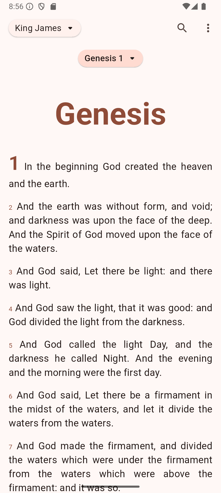
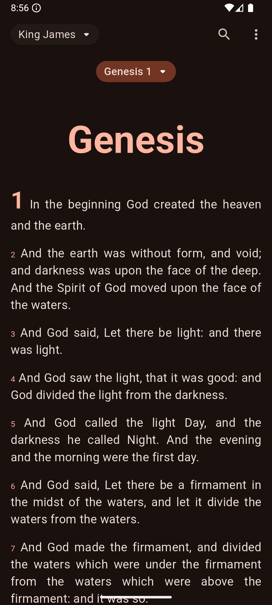
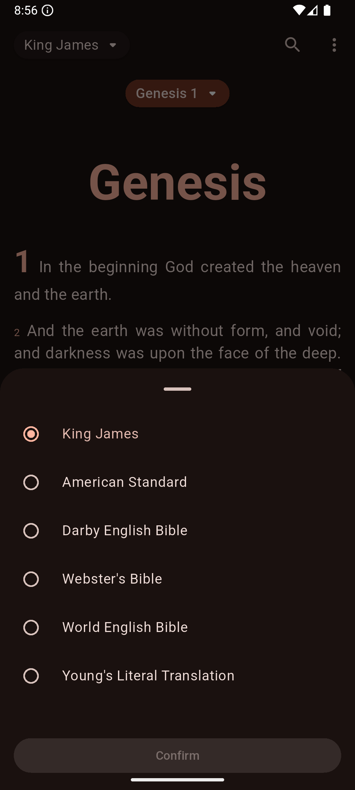
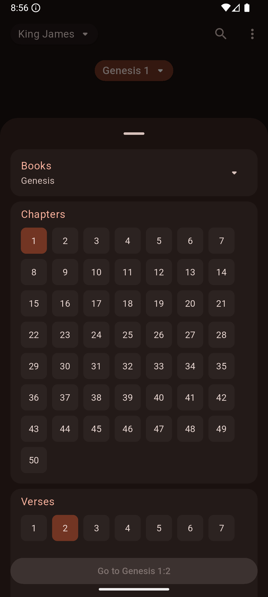
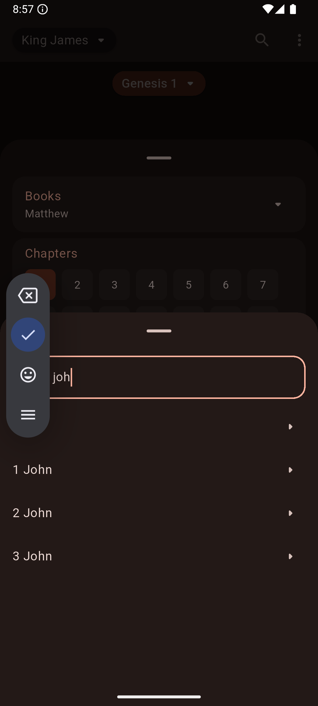
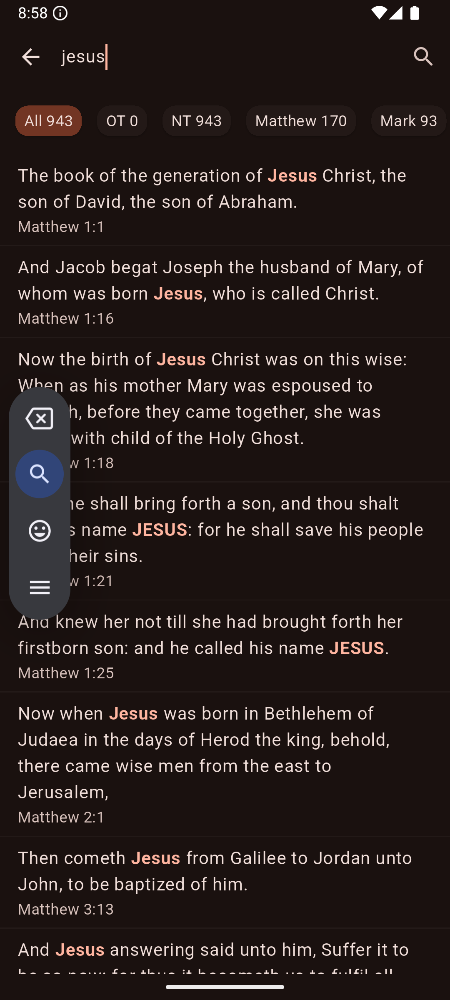

# The Word

Welcome to **The Word**, an open-source Flutter application designed to help users engage with the Bible through a seamless and modern user interface. Built with Flutter, Riverpod, and Firebase, this app provides verse navigation, search capabilities, bookmarking, and daily inspiration notifications.

## Features
- 📖 **Multiple Bible Versions**: Choose from various translations to suit your preference.
- 🔍 **Powerful Search**: Easily find verses across books and chapters.
- 📌 **Bookmarks**: Save and organize your favorite verses.
- 🔔 **Daily Notifications**: Receive inspirational verses throughout the day.
- 🌙 **Dark Mode**: Supports both light and dark themes for better readability.
- 📤 **Sharing**: Share verses with friends and family.

## Screenshots

  
  
  

  
  
  

*Screenshots (left to right): Home Light Theme, Home Dark Theme, Bible Versions, Navigate to Verse, Search Book, Search Word*

## Contributing

We welcome contributions! Whether you want to fix a bug, add a new feature, or improve documentation, we'd love to have you. Follow these steps to contribute:

1. Fork the repository.
2. Create a new branch: `git checkout -b feature-name`
3. Commit your changes: `git commit -m 'Add new feature'`
4. Push the branch: `git push origin feature-name`
5. Open a Pull Request.

## Issues

If you find any bugs or have feature requests, please open an issue [here](https://github.com/eijiotieno-official/bible_app/issues).

Happy coding! 🚀